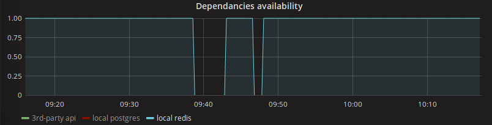

# aiohttp_prometheus_monitoring

This package allows to monitor availability of your aiohttp-application components and exports the metrics for prometheus scraper.

It can monitor:

- external host HTTP status
- postgres database status
- redis availability
- rabbit AMQP availability
- whatever else, as can be extended easily

It periodically calls services, stores boolean result in Gauge metrics and exports the metrics via the /metrics endpoint.

No additional workers required, everything is built-in into your app.

Then you can build graphs based on this data:
 

## Install:

    pip install aiohttp_prometheus_monitoring[amqp,redis,postgres]

## Sample config:

    MONITORING = {
        'route_ping': '/ping',
        'route_metrics': '/metrics',
    
        'metrics': [
            {
                'name': 'monitoring_http',
                'description': 'Check HTTP status',
                'module': 'aiohttp_prometheus_monitoring.metrics.http.HttpMetric',
                'sleep_time': 300,
                'params': {
                    'url': 'http://localhost/my_ping/',
                    'timeout': 1,
                    'verify_ssl': True,
                }
            },
            {
                'name': 'monitoring_redis',
                'description': 'Check redis connection',
                'module': 'aiohttp_prometheus_monitoring.metrics.redis.RedisMetric',
                'sleep_time': 60,
                'params': {
                    'host': 'localhost',
                    'port': '6379',
                }
            },
            {
                'name': 'monitoring_mq',
                'description': 'Check MQ connection',
                'module': 'aiohttp_prometheus_monitoring.metrics.amqp.AmqpMetric',
                'sleep_time': 60,
                'params': {
                    'host': 'localhost',
                    'port': '5672',
                    'user': 'root',
                    'password': '123',
                    'vhost': 'myvhost',
                }
            },
            {
                'name': 'monitoring_postgres',
                'description': 'Check postgres connection',
                'module': 'aiohttp_prometheus_monitoring.metrics.postgres.PostgresMetric',
                'sleep_time': 60,
                'params': {
                    'database': 'core',
                    'user': 'core',
                    'password': 'core',
                    'host': 'localhost',
                    'port': 5433,
                }
            },
        ]
    }

## Usage: 

    from aiohttp import web
    from aiohttp_prometheus_monitoring import setup_monitoring
    
    
    def create_app(loop=None):    
        app = web.Application()
        loop.run_until_complete(setup_monitoring(settings.MONITORING, app))
        
        return app

Check http://YOURAPP/ping and http://YOURAPP/metrics - /ping endpoint will respond "pong", /metrics endpoint will have metrics in prometheus format.
